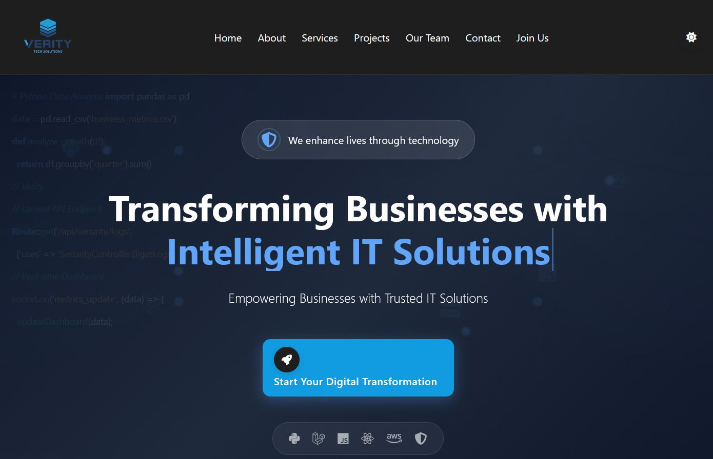
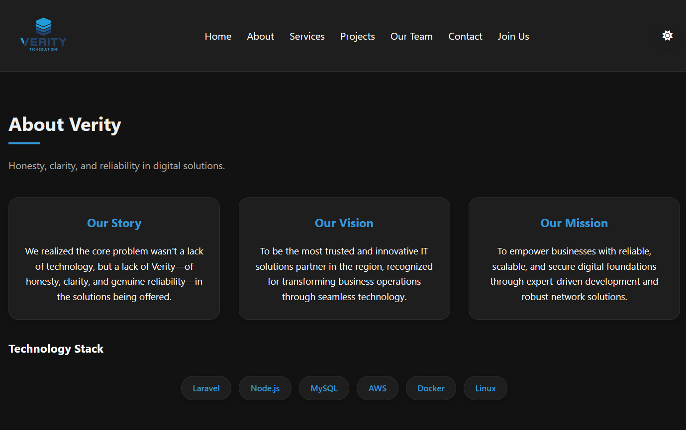
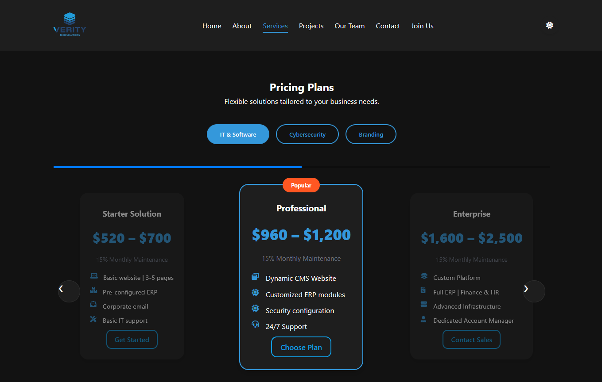
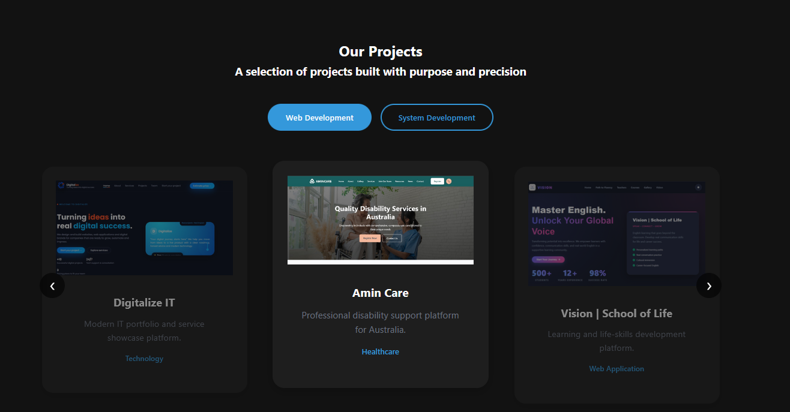
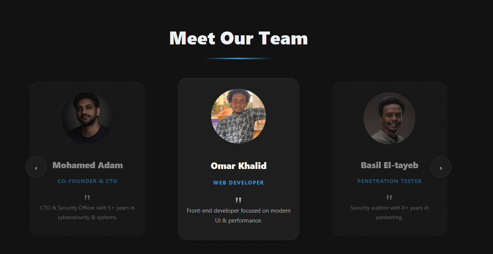
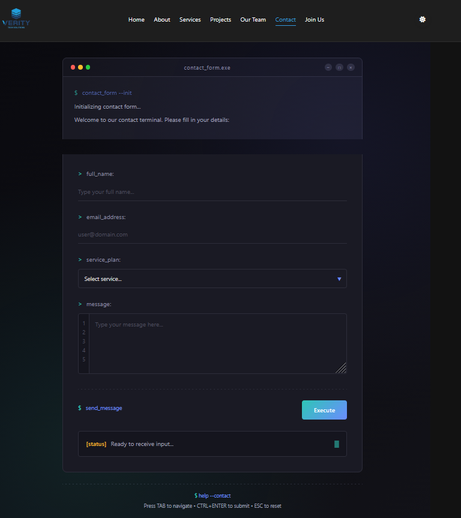
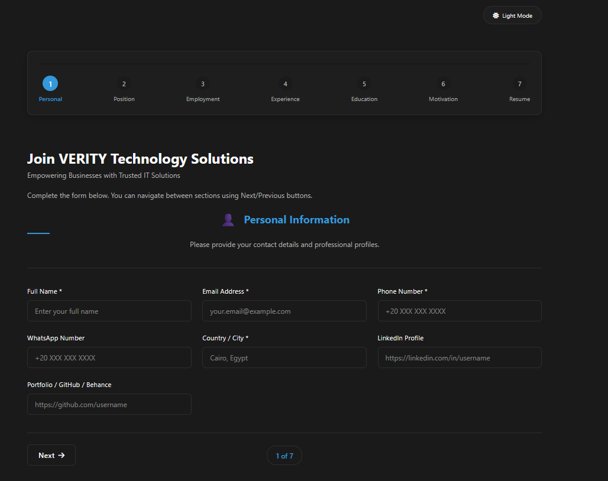

# Verity Web App

Verity is a modern, responsive web application designed for agencies and professional teams.  
It provides a polished public website alongside a powerful internal dashboard for managing hiring applications and user data.

---

## ✨ Features

### 🌐 Public Website
- **Home Page** – Clean hero layout with modern UI
- **About Section** – Interactive slider with multiple tabs
- **Projects Section** – Showcase completed and ongoing projects
- **Pricing Page** – Clear and structured service plans
- **Team Section** – Introduce team members professionally
- **Contact Page** – Modern contact form with validation
- **Hire Page** – Dedicated form for hiring new staff

### 📊 Dashboard
- View all submitted applications
- Filter applicants by status and criteria
- Organized data presentation
- Clean and user-friendly admin UI

---

## 🛠️ Tech Stack

- Laravel (PHP Framework)
- Blade Templating Engine
- HTML5 / CSS3
- Vanilla JavaScript
- MySQL

## 📸 Screenshots

### Home Page

### About Section

### Pricing

### Projects

### Team

### Contact Page

### Hire Form

### Dashboard

---

## 📁 Project Structure

